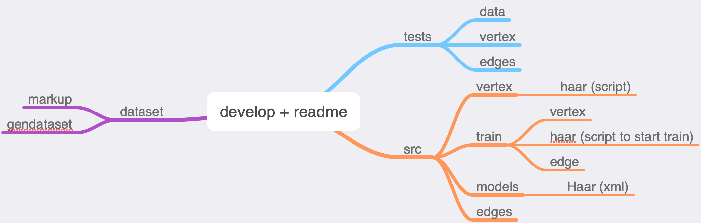

# NeiroGraph
## Course project

# Algorithm
<image src='alg.png'>

## Vertex search
- [x] Convert into black/white image
- [x] Search for hypotheses (vertices, coordinates of the center and radius) (OpenCV)
    - Center and radius (Hough transform)
    - Haar Cascade
    - Neural network
- [x] Filter with **neural network**

## Text recognition
- [ ] Mnist

## Edge search
- [x] Convert into black/white image
- [x] Canny edge detector

# Menu of repository

## dataset
- [Mark up](https://github.com/iu8-nn-2018/NeiroGraph/tree/develop/dataset/markup)
- [Generate dataset](https://github.com/iu8-nn-2018/NeiroGraph/tree/develop/dataset/gendataset)
- [Generate file .dat](https://github.com/iu8-nn-2018/NeiroGraph/tree/develop/dataset/gendat)
- [Filtering images](https://github.com/iu8-nn-2018/NeiroGraph/tree/develop/dataset/filtering_images)
- [Resize images](https://github.com/iu8-nn-2018/NeiroGraph/tree/develop/dataset/resize_images)

## src
- [Vertex](https://github.com/iu8-nn-2018/NeiroGraph/tree/develop/src/vertex)
- [Edges](https://github.com/iu8-nn-2018/NeiroGraph/tree/develop/src/edges)
- [Models](https://github.com/iu8-nn-2018/NeiroGraph/tree/develop/src/models)
- [Train](https://github.com/iu8-nn-2018/NeiroGraph/tree/develop/src/train)

# tests
- [Tests](https://github.com/iu8-nn-2018/NeiroGraph/tree/develop/test)

# Developer branches
- [Canny](https://github.com/iu8-nn-2018/NeiroGraph/tree/Canny)
- [Haar_Cascade for Google Cloud Platform](https://github.com/iu8-nn-2018/NeiroGraph/tree/Haar_Cascade)
- [Experiments](https://github.com/iu8-nn-2018/NeiroGraph/tree/experiments)
- [MarkUp](https://github.com/iu8-nn-2018/NeiroGraph/tree/markup)
