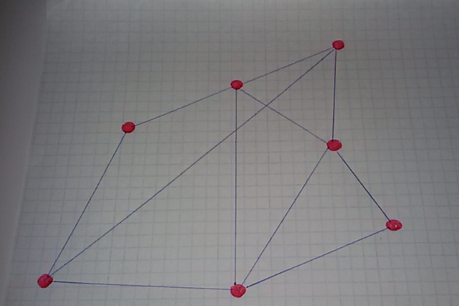
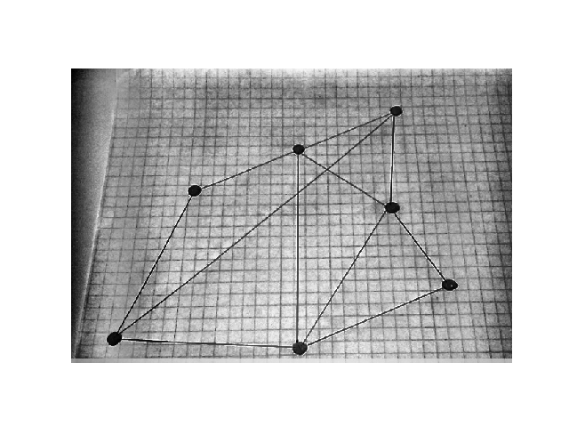
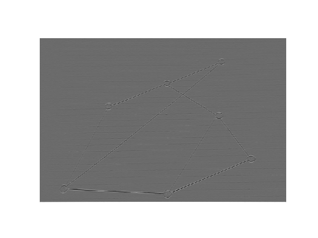
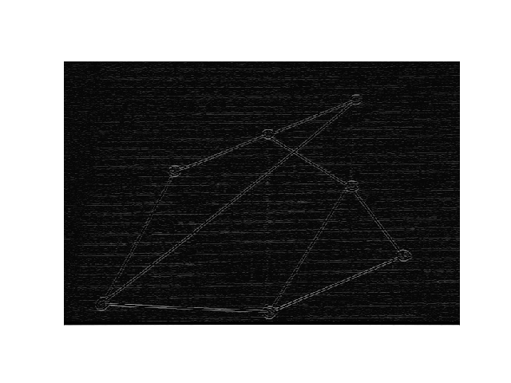

# NeiroGraph
## Course project

## Image convolution
The convolution is identical to the operation of the clipping but the core is mirrored during convolution

### Fighting the lack of pixels
* Filling with a constant
* Taking the nearest value
* Boundary mirroring

### Kernel
- [Kernel_cores](https://en.wikipedia.org/wiki/Kernel_(image_processing)

#### Who it works?


#### RGB and Kernel


## convolve.py
### Load the image 
```python
# Load the image
img = io.imread('12.png')
```
### Kernel
```python
# Convolve the sharpen kernel and the image
kernel = np.array([[0, -1, 0], [-1, 5, -1], [0, -1, 0]])
```
### convolution2d
```python
def convolve2d(image, kernel):
    # Flip the kernel
    kernel = np.flipud(np.fliplr(kernel))
    # convolution output
    output = np.zeros_like(image)
    # Add zero padding to the input image
    image_pad = np.zeros((image.shape[0] + 2, image.shape[1] + 2))
    image_pad[1:-1, 1:-1] = image

    # Loop over every pixel of the image
    for x in range(image.shape[1]):
        for y in range(image.shape[0]):
            # element-wise multiplication of the kernel and the image
            output[y, x] = (kernel * image_pad[y:y + 3, x:x + 3]).sum()
    return output

# Get a numpy array of size [image_height, image_width]
image_sharpen = convolve2d(img, kernel)
```
### Result







