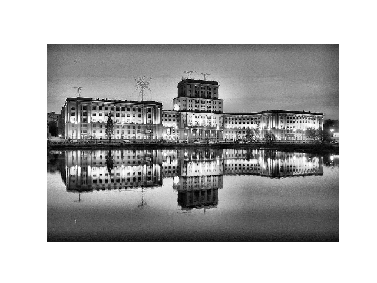
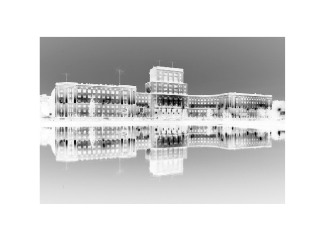
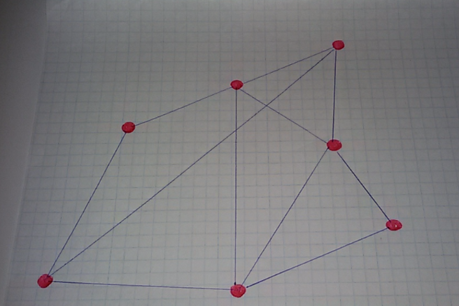

# NeiroGraph
## Course project

## Image convolution
The convolution is identical to the operation of the clipping but the core is mirrored during convolution

## Results convolve_2.py
### Original

### Convert to grey

### Result

## Results convolve.py
### Original

### Convert to grey

### Convert

### Result

